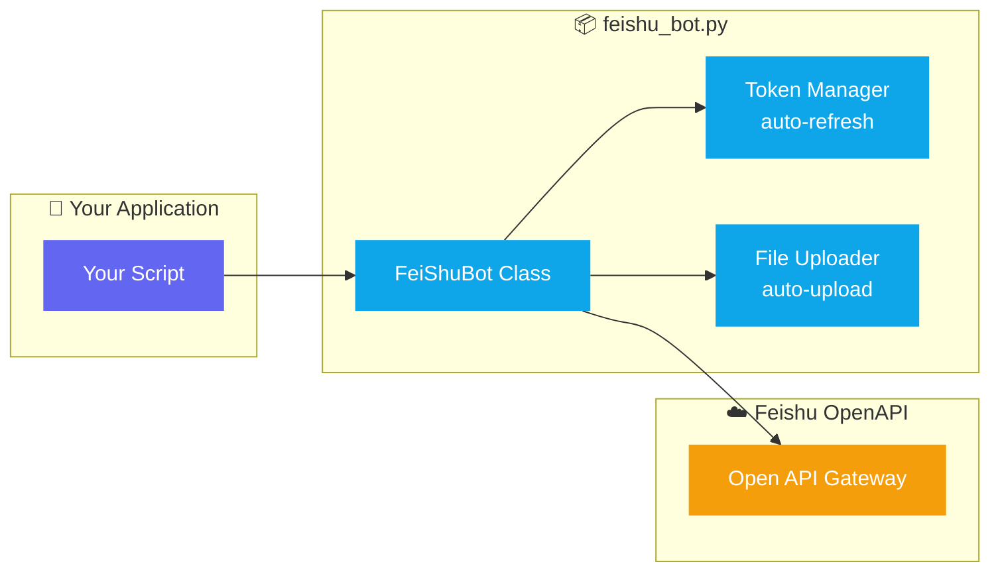

<div align="center">

# 📣 Feishu Bot Pusher

**Python module for sending 7 types of messages via Feishu (Lark) Bot API**

[](https://github.com/donglinfei-debug/feishu-bot-pusher/stargazers)
[](https://github.com/donglinfei-debug/feishu-bot-pusher/issues)
[](https://github.com/donglinfei-debug/feishu-bot-pusher/forks)
[](LICENSE)
[](https://www.python.org/)
[](https://open.feishu.cn/)

🌏 **Language / 语言**：[🇨🇳 中文](README.zh.md) | [🇬🇧 English](README.md)

</div>

---

A Python module for sending multi-type messages to **Feishu (Lark)** via the Open API Bot identity — not a webhook. Supports text, image, file, audio, video, rich text (post), and interactive card messages with automatic token management.


## 📌 Why This?

**You've built a Python script that needs to send messages to Feishu — but the webhook isn't enough.**

- **You want to send images, files, audio, video** — Feishu webhooks only support text and simple cards
- **Your token expires every 2 hours** — without automatic refresh, your bot goes silent until you manually re-authenticate
- **You need interactive cards** — the raw Feishu Open API is verbose and error-prone to call directly
- **You have multiple automation scripts** — each one ends up duplicating the same Feishu integration code

**Feishu Bot Pusher** wraps all of this into a single `from feishu_bot import FeiShuBot`. One import, 7 message types, automatic token management. Your scripts stay clean, your team stays notified.

## 🏗️ Architecture



## 📦 Features

| # | Feature | Description |
|:--|:--------|:------------|
| 1 | **7 Message Types** | Text, image, file, audio, video, rich text, interactive card |
| 2 | **Bot Identity** | Sends as a Feishu Bot (not a webhook) |
| 3 | **Auto Token Mgmt** | Caches `tenant_access_token` with auto-refresh |
| 4 | **Media Auto-Upload** | Uploads images/files before sending |
| 5 | **Flexible Config** | Env vars, config file, or constructor args |

## 📦 Requirements

| Requirement | Version |
|:------------|:--------|
| **Python** | 3.7+ |
| **requests** | Any recent version |
| **Feishu App** | Self-built app with Bot capability enabled |

## 🚀 Quick Start

```bash
pip install requests
```

```python
from feishu_bot import FeiShuBot

bot = FeiShuBot()

# Send text
bot.send_text("Hello from Feishu Bot")

# Send image
bot.send_image("screenshot.png")

# Send rich text
bot.send_post("Notice", [
    {"tag": "md", "text": "**Update**: v2.0 released"},
    {"tag": "a", "text": "Details", "href": "https://example.com"},
])
```

## 📁 Files

```
feishu-bot-pusher/
├── feishu_bot.py         # Core module — FeiShuBot class
├── feishu_config.json    # Config file (optional)
├── .env.example          # Environment variable template
├── requirements.txt      # requests
├── LICENSE               # MIT
└── README.md / README.zh.md
```


## ❓ FAQ

**Can I send messages to a group chat instead of an individual user?**
Yes. Feishu Bot supports both private chat and group chat. Set the receive_id_type to chat_id to send to a group.

**Does this support Feishu interactive cards with buttons?**
Yes. `send_card()` supports color headers, buttons, markdown content, and dividers. You pass a standard Feishu card JSON structure.

**How does token auto-refresh work?**
The FeiShuBot caches tenant_access_token in memory and automatically requests a new one before it expires — so you never get 99991663 auth errors.

**Can I use this with multiple Feishu apps?**
Yes. Create multiple FeiShuBot instances with different app_id/app_secret pairs. Each manages its own token lifecycle independently.

## 📄 License

MIT © 2026 Ryan Dong

## 🌟 Star History

[](https://star-history.com/#donglinfei-debug/feishu-bot-pusher&Date)


## 👤 About the Author

**Ryan Dong** — AI Product Manager & Full-Stack Developer

I bridge the gap between AI capabilities and production-ready software. My work spans the full stack: from designing AI-powered product features and integrating LLM APIs, to building modular backend services and shipping clean, documented code.

| Role | Focus |
|:-----|:------|
| 🧠 **AI Product Manager** | Product strategy, AI feature design, prompt engineering, model selection |
| 💻 **Full-Stack Developer** | Python, FastAPI, Google Apps Script, automation pipelines, API integration |

This repository is part of a personal toolbox — a growing collection of practical, reusable modules that solve real automation problems. Each project is designed to be independently useful and easily integrated into larger systems.

📬 **donglinfei@gmail.com** — open to business discussions, collaborations, and recruiting inquiries.

## 📬 Contact

Ryan Dong — donglinfei@gmail.com
