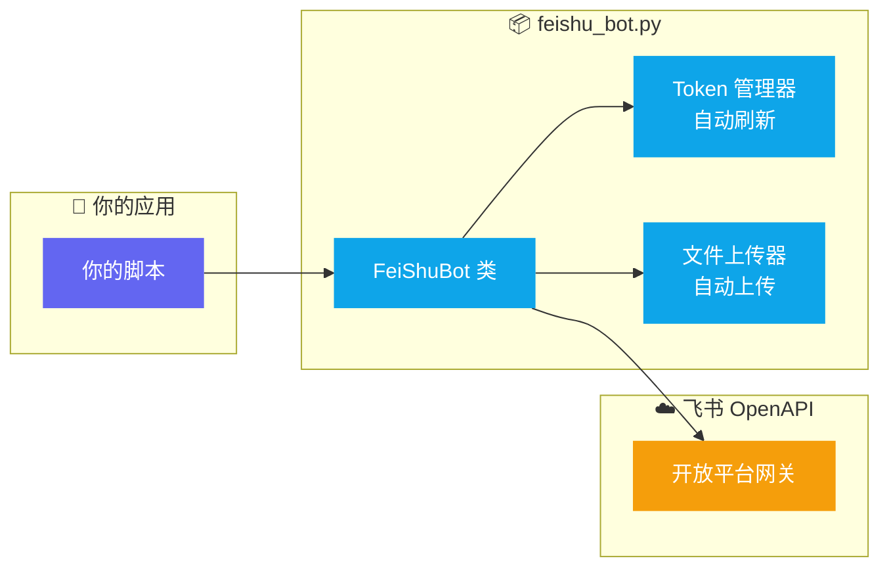

<div align="center">

# 📣 飞书消息推送器 (Feishu Bot Pusher)

**Python 飞书 Bot 推送模块 · 7 种消息类型 · Token 自动管理**

[](https://github.com/donglinfei-debug/feishu-bot-pusher/stargazers)
[](https://github.com/donglinfei-debug/feishu-bot-pusher/issues)
[](https://github.com/donglinfei-debug/feishu-bot-pusher/forks)
[](LICENSE)
[](https://www.python.org/)
[](https://open.feishu.cn/)

🌏 **语言 / Language**：[🇨🇳 中文](README.zh.md) | [🇬🇧 English](README.md)

</div>

---

基于飞书 OpenAPI 自建应用 Bot 身份的消息推送模块。支持 7 种消息类型：文本、图片、文件、音频、视频、富文本、交互卡片。自动管理 Token 生命周期，内置文件上传能力。


## 📌 为什么需要这个模块？

**你的 Python 脚本需要发消息到飞书，但 Webhook 机器人根本不够用。**

- **你想发图片、文件、音频、视频**——飞书 Webhook 只支持文本和简单的卡片
- **Token 每两小时过期**——没有自动刷新，Bot 就静默罢工了
- **你需要交互卡片**——飞书 Open API 的原始调用极其冗长，容易出错
- **你有多个自动化脚本**——每个脚本都得重写一遍飞书集成代码

**Feishu Bot Pusher** 把所有复杂封装成一行 `from feishu_bot import FeiShuBot`。一个 import，7 种消息类型，Token 自动管理。

## 🏗️ 架构示意



## 📦 功能特性

| # | 特性 | 说明 |
|:--|:-----|:------|
| 1 | **7 种消息类型** | 文本、图片、文件、音频、视频、富文本、交互卡片 |
| 2 | **Bot 身份发送** | 自建应用 Bot 身份，非 Webhook |
| 3 | **Token 自动管理** | 缓存 `tenant_access_token`，过期自动刷新 |
| 4 | **媒体自动上传** | 图片/文件自动上传后再发送 |
| 5 | **灵活配置** | 环境变量 / 配置文件 / 构造参数三种方式 |

## 📦 系统要求

| 要求 | 说明 |
|:-----|:------|
| **Python** | 3.7+ |
| **依赖** | `requests` |
| **飞书应用** | 自建应用，已开启机器人能力 |

## 🚀 快速开始

```bash
pip install requests
```

```python
from feishu_bot import FeiShuBot

bot = FeiShuBot()
bot.send_text("你好，飞书机器人")
bot.send_image("截图.png")
bot.send_file("报告.pdf")
```

## 📁 文件结构

```
feishu-bot-pusher/
├── feishu_bot.py         # 核心模块 — FeiShuBot 类
├── feishu_config.json    # 配置文件（可选）
├── .env.example          # 环境变量模板
├── requirements.txt      # requests
├── LICENSE               # MIT
└── README.md / README.zh.md
```

## ❓ 常见问题

**可以发消息到群聊而不是个人吗？**
可以。设置 receive_id_type 为 chat_id 即可发送到群聊。

**支持带按钮的交互卡片吗？**
支持。`send_card()` 支持颜色头、按钮、Markdown 内容和分隔线。

**Token 自动刷新怎么工作的？**
FeiShuBot 在内存中缓存 tenant_access_token，在过期前自动申请新 Token——你不会再遇到 99991663 认证错误。

**可以同时使用多个飞书应用吗？**
可以。创建多个 FeiShuBot 实例，各自管理自己的 Token 生命周期。

## 📄 许可证

MIT © 2026 Ryan Dong

## 🌟 Star 历史

[](https://star-history.com/#donglinfei-debug/feishu-bot-pusher&Date)


## 👤 关于作者

**Ryan Dong** — AI 产品经理 & 全栈开发者

我在 AI 能力与生产级软件之间架桥。工作覆盖全栈：从 AI 驱动的产品功能设计、LLM API 集成，到模块化的后端服务和干净、文档完整的代码交付。

| 角色 | 专注领域 |
|:-----|:---------|
| 🧠 **AI 产品经理** | 产品策略、AI 功能设计、Prompt 工程、模型选型 |
| 💻 **全栈开发者** | Python、FastAPI、Google Apps Script、自动化管线、API 集成 |

本仓库是我个人工具箱的一部分——一个不断增长的、解决实际自动化问题的模块集合。每个项目设计为独立可用、易于集成到更大的系统中。

📬 **donglinfei@gmail.com** — 欢迎商务合作、技术交流和招聘联系。

## 📬 联系方式

Ryan Dong — donglinfei@gmail.com
